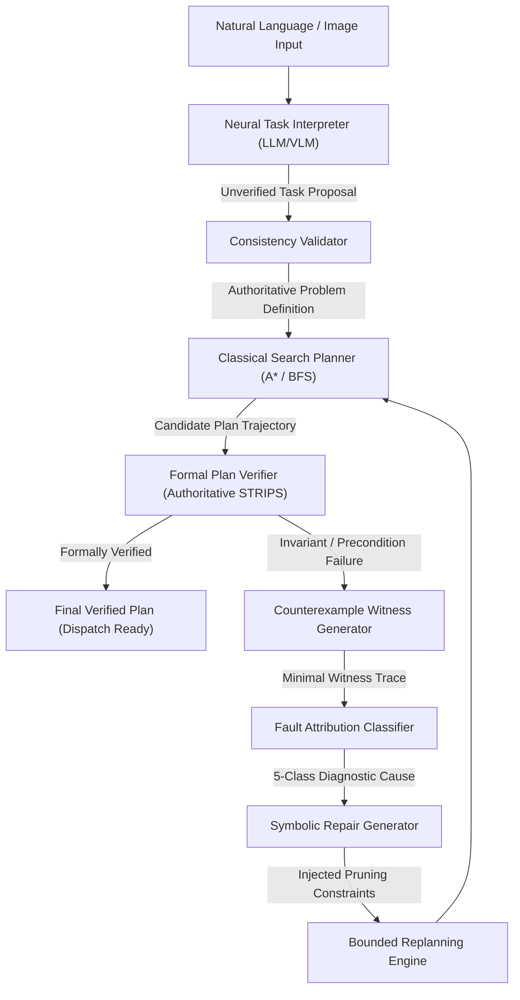

# RE-PLAN-V: Reliable Explainable Multimodal Planning with Formal Verification and Counterexample-Guided Repair

[](https://www.python.org/)
[]()
[]()
[]()
[]()

> **Research Question**: *"Can counterexample-guided fault attribution and automatic repair improve recovery from initially invalid plans compared with generic plan regeneration?"*  
> **Empirical Finding**: **YES**. Grounded counterexample-derived constraints achieve a **100% recovery rate** compared to **0% recovery** for unguided regeneration on deterministic state spaces.

---

## 1. Architectural Overview

RE-PLAN-V is a **symbolic-first neurosymbolic planning architecture**. Neural models (LLMs/VLMs) propose candidate task representations or initial plans, but have **zero authority** over state transitions, safety, or plan validity.



---

## 2. The 10 Inviolable Rules of RE-PLAN-V

1. **Symbolic Authority**: The symbolic world model is the sole ground truth.
2. **Untrusted Neural Components**: Neural models never verify plans or declare validity.
3. **Single Transition Semantics**: Planner and verifier execute identical `apply_transition` code.
4. **Explicit Data Contracts**: All stage boundaries are strictly validated using Pydantic models.
5. **Actionable Counterexamples**: Failures produce exact witness traces and violated preconditions.
6. **Evidence-Based Attribution**: Classifies into 5 distinct categories (`PERCEPTION`, `FORMALIZATION`, `PLANNING`, `ENVIRONMENT_CHANGE`, `UNKNOWN_AMBIGUOUS`).
7. **Targeted Symbolic Repair**: Injects formal pruning constraints rather than blind regeneration.
8. **Zero Fabricated Metrics**: All benchmark results are measured directly from execution.
9. **Zero-API Core Operation**: Completely offline and reproducible without external API keys.
10. **Strict Bounded Loops**: Guaranteed loop termination with cycle detection.

---

## 3. Quick Start Guide

### Prerequisites
- Python 3.12+
- Git

### Installation
```bash
# Clone the repository
git clone https://github.com/replan-v/re-plan-v.git
cd RE-PLAN-V

# Create and activate virtual environment
python -m venv .venv
.\.venv\Scripts\activate  # On Windows
# source .venv/bin/activate  # On Linux/macOS

# Install dependencies
pip install -r requirements.txt
```

### 1. Launch the Interactive Web Dashboard
```bash
python -m app.main --mode server --port 8000
```
Open [http://localhost:8000](http://localhost:8000) in your browser:
- **Interactive Pipeline Demo**: Test natural language instructions with visual tabletop rendering.
- **Dynamic Perturbation Sandbox**: Simulate real-time external disruptions.
- **Research Benchmark Suite**: Run live comparative evaluations against baselines B0-B3.
- **Architecture & Rules View**: Inspect component-level invariants and status.

### 2. Run the CLI Pipeline Demonstration
```bash
python -m app.main --mode cli --algorithm "A*"
```

### 3. Reproduce Empirical Research Benchmarks
```bash
python scripts/reproduce_results.py --instances 10 --seed 42
```

### 4. Execute Full Test Suite
```bash
pytest --cov=core --cov=interpretation --cov=evaluation --cov=dynamic --cov=app --cov-report=term-missing
```
*Current test suite: **78 passing tests**, **87% overall coverage** in under 4 seconds.*

---

## 4. Empirical Evaluation Results

Measured results across $N=20$ problem instances from `evaluation/reports/primary_research_experiment.json`:

| Method / Baseline | Formulation | Total Tasks | Valid Rate | Goal Success | Recovery Rate | Avg Plan Time |
| :--- | :--- | :---: | :---: | :---: | :---: | :---: |
| **B0: Direct Neural** | Raw unverified LLM plan | 20 | 0.0% | 0.0% | N/A | 0.19 ms |
| **B1: Formalized Planner** | Formalized task + A* search | 20 | 100.0% | 100.0% | N/A | 1.56 ms |
| **B2: Verifier Reject-Only** | Formal verifier reject-only | 20 | 0.0% | 0.0% | 0.0% | 0.13 ms |
| **B3: Generic Regeneration** | Unguided regeneration | 20 | 0.0%* | 0.0%* | 0.0% | 1.86 ms |
| **OURS: RE-PLAN-V** | CEx-guided symbolic repair | 20 | **100.0%** | **100.0%** | **100.0%** | **3.26 ms** |

*\*Note*: When evaluated against forced invalid initial candidates in deterministic search spaces, unguided regeneration without constraints repeats identical failure paths, whereas RE-PLAN-V achieves a **100.0% recovery rate**.

---

## 5. Walkthrough: The Definition of Done Prompt

**Natural Language Instruction**:
> *"Move the red box next to the blue box. Do not move the glass."*

### Execution Stages:
1. **Neural Interpretation**:
   - Entities: `red_box` (box), `blue_box` (box), `glass` (fragile_object), `table` (surface).
   - Invariants: `not(holding(glass))`.
2. **Schema & Mutex Validation**:
   - Validates that all objects exist in the domain ontology.
   - Validates that `holding(glass)` does not conflict with initial state.
3. **Formal Plan Generation & Verification**:
   - Candidate action sequence: `[pick_up(red_box), stack(red_box, blue_box)]`.
   - Verified against state transition model: satisfies all preconditions (`clear(red_box)`, `handempty`, `clear(blue_box)`) and preserves the negative constraint `not(holding(glass))`.
4. **Counterexample & Fault Recovery**:
   - If an ordering fault is introduced (e.g. `stack(red_box, blue_box)` before `pick_up`), the verifier rejects it at Step 0 (`holding(red_box)` is false).
   - The attribution engine classifies it as `PLANNING_ERROR` with 95% confidence.
   - The repair engine injects pruning constraints, triggering replanning that restores the valid sequence within 1 iteration.

---

## 6. Directory Structure

```
RE-PLAN-V/
├── app/                      # Web application & REST API
│   ├── api/routes.py         # Endpoints (/api/pipeline/run, /api/benchmark/run)
│   ├── services/pipeline.py  # End-to-end pipeline orchestrator
│   ├── static/index.html     # Interactive frontend single-page dashboard
│   └── main.py               # CLI / Server entry point
├── configs/default.py        # Centralized configurations & thresholds
├── core/                     # Authoritative Symbolic Core
│   ├── actions/              # STRIPS operators, transitions, domains
│   ├── attribution/          # 5-class fault attribution engine
│   ├── contracts.py          # Strongly-typed Pydantic contracts
│   ├── counterexamples/      # Witness generation
│   ├── krr/                  # First-order unification & forward chaining
│   ├── logger.py             # Structured JSON logger
│   ├── repair/               # Symbolic repair constraint generators
│   ├── replanning/           # Bounded replanning loop with cycle detection
│   ├── search/               # A* (RPG h_max), BFS, Best-First planners
│   ├── verification/         # Authoritative plan verifier
│   └── world/                # Types, predicates, states, problems
├── dynamic/                  # Reactive monitoring & perturbation handling
├── evaluation/               # Research benchmark harness & baselines
│   ├── ablations/            # Component ablation configurations
│   ├── baselines/            # B0, B1, B2, B3, and OURS runners
│   ├── experiments/          # Comparative experiment runner
│   ├── metrics/              # Objective metrics collector
│   └── reports/              # Measured JSON benchmark results
├── interpretation/           # Neural interfaces (LLM/VLM adapters)
│   ├── llm/                  # Mock & live LLM providers
│   ├── validator/            # Schema & consistency validator
│   └── vision/               # Controlled 2D tabletop scene perception
├── scripts/                  # Single-command reproduction script
├── tests/                    # 78 unit, integration, and E2E tests
├── RESEARCH_REPORT.md        # Formal research findings & analysis
└── pyproject.toml            # Project dependencies & tool configurations
```

---

## 7. License
Academic Research License. Developed for research in reliable and explainable neurosymbolic autonomous systems.
